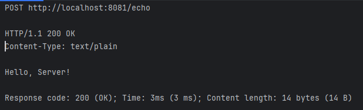
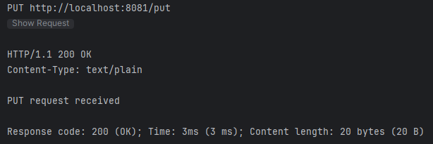
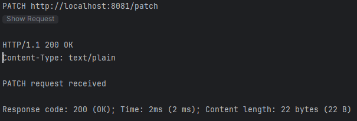
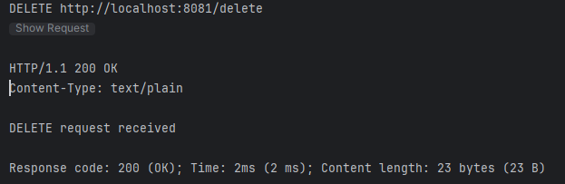
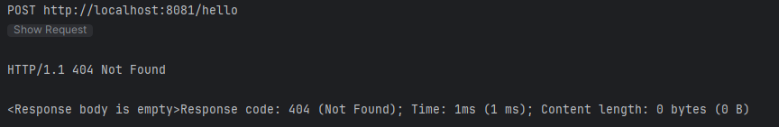

# Java Core HTTP Server

This project is a simple HTTP server implemented in Java using the core Java libraries. It supports handling HTTP requests with various methods (GET, POST, PUT, PATCH, DELETE) and allows adding custom handlers for specific paths and methods.

## Features

- Implements a subset of the HTTP 1.1 protocol using `ServerSocketChannel` from `java.nio`
- Supports the following HTTP methods: GET, POST, PUT, PATCH, DELETE
- Allows adding custom handlers for specific paths and methods
- Provides access to request parameters (headers, method, body)
- Supports sending HTTP responses back to the client

## Project Structure

The project has the following structure:

- `src/main/java`: Contains the main Java source files
    - `com.example`: Package containing the server implementation
        - `App.java`: The main class that creates and starts the HTTP server
        - `HttpServer.java`: The HTTP server implementation
        - `HttpRequest.java`: Represents an HTTP request
        - `HttpResponse.java`: Represents an HTTP response
        - `HttpHandler.java`: Interface for custom request handlers
- `src/test/java`: Contains the test files
    - `HttpServerTest.java`: Unit tests for the HTTP server
    - `tests.http`: HTTP requests for testing the server endpoints
- `pom.xml`: Maven configuration file for the project

## Getting Started

To run the HTTP server:

1. Clone the repository:

```bash
git clone https://github.com/your-username/java-core-http-server.git
```

2. Navigate to the project directory:

```bash
cd java-core-http-server
```

3. Build the project using Maven:

```bash
mvn clean install
```

4. Run the server:

```bash
java -jar target/java-core-http-server.jar
```

The server will start running on `localhost` with the specified port (default is 8081).

## Usage

- GET Request


- POST Request



- PUT Request



- PATCH Request



- DELETE Request



- Non-existent request



## Adding Custom Handlers

To add custom handlers for specific paths and methods, you can modify the `App.java` file. Here's an example of adding a handler:

```java
server.addHandler("/hello", "GET", request -> {
     Map<String, String> headers = new HashMap<>();
     headers.put("Content-Type", "text/plain");
     return new HttpResponse(200, "OK", headers, "Hello, World!");
});
```

